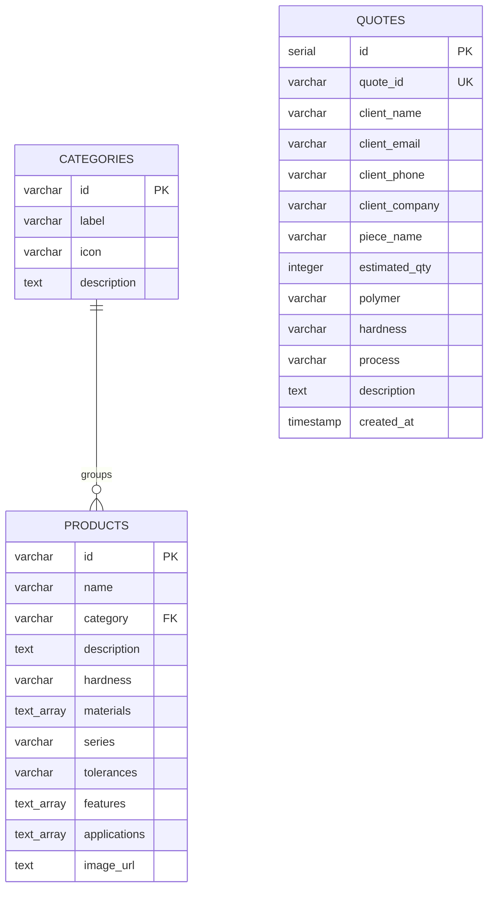

# ⚙️ EURL TCP — Industrial Platform & AI-Powered Showcase

> **EURL TCP (Tous Caoutchoucs Plastiques)** — A full-stack industrial web application designed for a custom technical rubber parts manufacturer, featuring an interactive product showcase, a material comparison lab, an AI engineering assistant powered by Google Gemini, a step-by-step quote request system, and a passcode-protected administrative dashboard backed by PostgreSQL.

---

## 🏗️ Architecture & How It Was Built

This application was engineered as a high-performance, full-stack monorepo web application bridging modern frontend WebGL experiences with a resilient Node.js / Express backend and PostgreSQL storage.

```
┌─────────────────────────────────────────────────────────────────────────┐
│                           REACT 19 FRONTEND                             │
│ ┌───────────────────┬────────────────────┬────────────────────────────┐ │
│ │  WebGL Background │ Tailwind v4 & Motion│   Interactive Components   │ │
│ │  (OGL Shaders)    │ (BorderGlow Cards) │ (Catalog, AI Lab, Quotes)  │ │
│ └───────────────────┴────────────────────┴────────────────────────────┘ │
└────────────────────────────────────┬────────────────────────────────────┘
                                     │ JSON API Requests
┌────────────────────────────────────▼────────────────────────────────────┐
│                       EXPRESS 4 / NODE.JS BACKEND                       │
│ ┌───────────────────────────┬────────────────────────┬────────────────┐ │
│ │ Gemini 2.5 AI Consultant  │ PostgreSQL Pool Client │ Fallback Rule  │ │
│ │ (@google/genai SDK)       │ (Neon Postgres `pg`)   │ Engine & Data  │ │
│ └───────────────────────────┴────────────────────────┴────────────────┘ │
└─────────────────────────────────────────────────────────────────────────┘
```

### 1. Full-Stack Application Architecture
The platform operates as a unified Node.js / Express application serving both RESTful API routes and client-side single-page application (SPA) assets.

- **Frontend Core**: Built with **React 19** and **TypeScript** for strict type safety across all data contracts (products, categories, quote requests, AI messages).
- **Backend API Layer**: Developed in **TypeScript** using **Express 4**. It handles server-side business logic, AI prompt engineering, database persistence, and intelligent fallback systems.
- **Production Bundling Strategy**: Uses **Vite 6** to build optimized React client assets and **esbuild** to compile the Node.js TypeScript API server into a single executable bundle (`dist/server.cjs`).

---

## 🎨 Frontend Architecture & Design System

### 1. High-Performance WebGL Background Engine (`LineWaves.tsx`)
- Built using **OGL** (a lightweight 3D WebGL library) to render real-time animated wave mesh simulations.
- Implements custom GLSL vertex and fragment shaders for smooth dynamic lighting and color gradients without overloading the main UI rendering thread.

### 2. Micro-Interactions & Styling System (`BorderGlow.tsx`, Tailwind CSS v4)
- Leverages **Tailwind CSS v4** for modern, utility-first responsive layouts.
- Integrates custom canvas-based raycasting and mouse tracking (`BorderGlow.tsx`) that dynamically renders illuminated radial borders around feature cards based on cursor position.
- Employs **Motion (Framer Motion v12)** for structural transitions, modal overlays, step-by-step form page shifts, and interactive filtering animations.

### 3. Component Hierarchy & Modular Structure
- `Hero.tsx`: High-impact landing presentation featuring WebGL background integration and quick call-to-actions.
- `ProductsSection.tsx` & `ProductCard.tsx`: Dynamic catalog renderer supporting live category filtering, modal expansions, Shore A hardness specifications, and ISO 3302-1 standard tolerances.
- `MaterialsGuide.tsx`: An interactive elastomer comparison matrix evaluating polymer families (NBR, EPDM, FKM/Viton, VMQ Silicone, NR, CR) with visual metrics for chemical and thermal resilience.
- `BureauEtudesAI.tsx`: A real-time conversational interface designed for industrial engineers seeking technical advice, material selection, and molding process suitability.
- `QuoteForm.tsx`: A multi-step interactive quote builder with real-time form state validation and instant submission to PostgreSQL.
- `AdminModal.tsx`: A secure modal dashboard providing full CRUD management over catalog items and viewing/exporting client quotes.

---

## 🤖 AI Engineering & Gemini Integration

The **Bureau d'Études AI** assistant is built using the official `@google/genai` SDK with **Google Gemini 2.5 Flash**:

- **Domain-Specific Prompt Engineering**: The backend constructs system prompts instructing Gemini to act as a senior rubber formulation and mechanical design engineer specializing in elastomer chemistry, vulcanization processes, and ISO 3302-1 molding tolerances.
- **Dual-Layer Fallback Architecture**: In case the API key is missing or quota is exceeded, the server seamlessly executes a local heuristic rule engine (`fallbackAdvise` function in `api/index.ts`). It analyzes key intent indicators (e.g., oil resistance -> NBR, weather/ozone -> EPDM, extreme temperature/chemicals -> FKM) and formats response markdown seamlessly.

---

## 🗄️ Database Architecture & Data Persistence

The project utilizes **PostgreSQL** (hosted via Neon Serverless Postgres) for persistent data storage using connection pooling (`pg.Pool`).

### Entity Relationship Model



- **Resilient Fallback Mechanics**: If the PostgreSQL database connection is unavailable during development, the backend automatically falls back to an in-memory catalog dataset (`src/data.ts`) to ensure 100% uptime for visual showcase features.

---

## 🔒 Security & Admin Model

- **Passcode Protection**: Administrative endpoints (`POST/PUT/DELETE /api/products`, `GET /api/quotes`) validate an administrator authorization header matched against the environment-configured `ADMIN_PASSCODE`.
- **Environment Isolation**: Sensitive credentials (database connection strings, Gemini API keys, admin secrets) are encapsulated in server-side process environments and never exposed to the client bundle.

---

## 🔌 API Route Architecture

| Method | Route | Built For |
| :--- | :--- | :--- |
| `GET` | `/api/health` | System diagnostics & PostgreSQL pool status check |
| `GET` | `/api/categories` | Catalog category retrieval |
| `GET` | `/api/products` | Complete catalog product fetching |
| `POST` | `/api/products` | Admin catalog item creation |
| `PUT` | `/api/products/:id` | Admin catalog item updating |
| `DELETE` | `/api/products/:id` | Admin catalog item deletion |
| `GET` | `/api/quotes` | Admin retrieval of submitted RFQs |
| `POST` | `/api/quotes` | Public client RFQ submission |
| `POST` | `/api/ai/consultant` | Gemini AI technical engineering consultation |

---

## 🛠️ Technology Stack Breakdown

- **Frontend**: React 19, TypeScript, Vite 6, Tailwind CSS v4, Motion 12, OGL WebGL, Lucide React, React Markdown
- **Backend**: Node.js, Express 4, `tsx`, `esbuild`
- **Database**: PostgreSQL (Neon Serverless Postgres), `pg` Native Driver
- **Artificial Intelligence**: Google Gen AI SDK (`@google/genai`), Gemini 2.5 Flash
